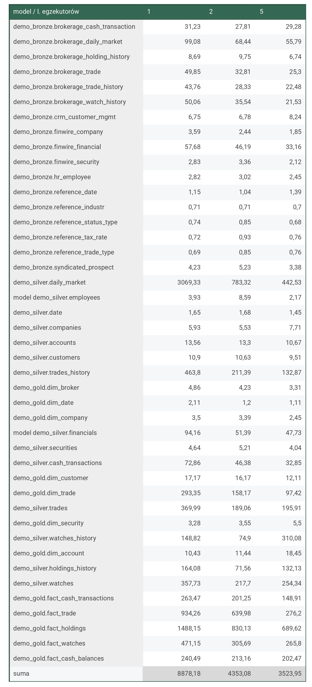

0. The goal of phase 2b is to perform benchmarking/scalability tests of sample three-tier lakehouse solution.

1. In main.tf, change machine_type at:

```
module "dataproc" {
  depends_on   = [module.vpc]
  source       = "github.com/bdg-tbd/tbd-workshop-1.git?ref=v1.0.36/modules/dataproc"
  project_name = var.project_name
  region       = var.region
  subnet       = module.vpc.subnets[local.notebook_subnet_id].id
  machine_type = "e2-standard-2"
}
```

and subsititute "e2-standard-2" with "e2-standard-4".

2. If needed request to increase cpu quotas (e.g. to 30 CPUs):
https://console.cloud.google.com/apis/api/compute.googleapis.com/quotas?project=tbd-2023z-9918

We requested the CPUs quota increase, but it was denied in the europe-west1 region.
Then, we attempted to increase the quota in a different region and succeeded in the europe-central2 region.
Therefore, we moved the infrastructure to that region from this point on.

3. Using tbd-tpc-di notebook perform dbt run with different number of executors, i.e., 1, 2, and 5, by changing:
```
 "spark.executor.instances": "2"
```
Testy wykonaliśmy dla 1, 2 i 5 Sparkowych egzekutorów.

in profiles.yml.

4. In the notebook, collect console output from dbt run, then parse it and retrieve total execution time and execution times of processing each model. Save the results from each number of executors.

5. Analyze the performance and scalability of execution times of each model. Visualize and discucss the final results.

W poniższej tabeli znajdują się czasy wykonania `dbt run` dla każdego modelu i liczby egzekutorów równej 1,2 albo 5. Ostatni wiersz tabeli zawiera sumaryczny czas wszystkich modeli dla każdej liczby egzekutorów. Sumaryczny czas jest przedstawiony także na wykresie.




Można zauważyć, że wraz ze wzrostem liczby egzekutorów spada całkowity czas egzekucji modeli. Przy czym dodanie kolejnego egzekutora, poprawia wyniki bardziej, gdy początkowa liczba egzekutorów jest mniejsza. Przy zmianie 1-> 2 egzekutory zauważyliśmy zmniejszenie się czasu egzekucji wszystkich modeli o ponad połowę. Po zwiększeniu liczby egzekutorów 2 -> 5, oszczędność czasu była już znacznie mniejsza. 
 
O ile sumaryczny czas dla wszystkich modeli był mniejszy po dodaniu dodatkowych egzekutorów, to nie dla każdego pojedynczego modelu zaobserwowaliśmy poprawę czasu. Modele, których czas egzekucji był najniższy (do kilku sekund), nie zawsze wraz z większą liczbą egzekutorów, uzyskiwały lepszy czas. Za to modele, których czas był najdłuższy (kilkaset sekund), odnotowywały dwu- trzykrotnie niższe czasy po zwiększeniu liczby egzekutorów.

