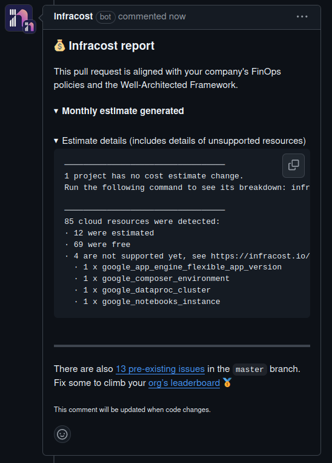
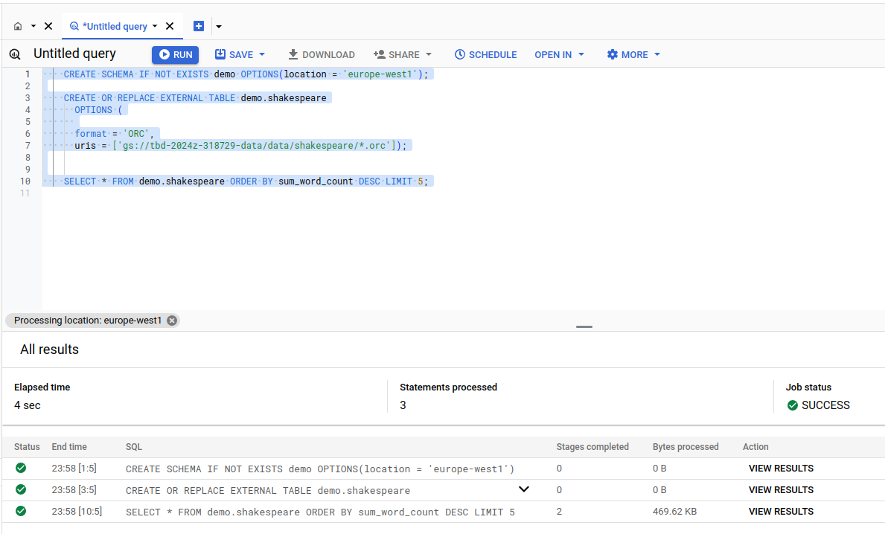
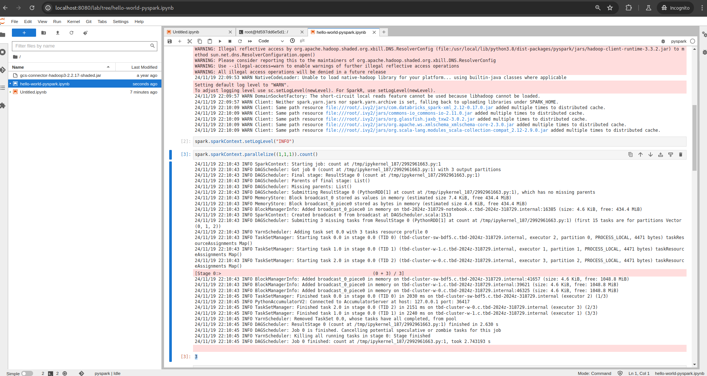

IMPORTANT ❗ ❗ ❗ Please remember to destroy all the resources after each work session. You can recreate infrastructure by creating new PR and merging it to master.


1. Authors:

   Z11

   https://github.com/kstawarski/tbd-workshop-1

2. Follow all steps in README.md.

3. Select your project and set budget alerts on 5%, 25%, 50%, 80% of 50$ (in cloud console -> billing -> budget & alerts -> create buget; unclick discounts and promotions&others while creating budget).

  

5. From avaialble Github Actions select and run destroy on main branch.

7. Create new git branch and:
    1. Modify tasks-phase1.md file.

    2. Create PR from this branch to **YOUR** master and merge it to make new release.

    


8. Analyze terraform code. Play with terraform plan, terraform graph to investigate different modules.

    Selected module: jupyter_docker_image

    This module is responsible for building a Jupyter docker image and if the SHA1 sum of the `resources` directory change, it uploads the image to registry.

   


9. Reach YARN UI

    Command used:
    `gcloud compute ssh tbd-cluster-m --project=tbd-2024z-318729 --zone=europe-west1-d --tunnel-through-iap -- -L 8088:localhost:8088`
   


10. Draw an architecture diagram (e.g. in draw.io) that includes:
    1. VPC topology with service assignment to subnets
    2. Description of the components of service accounts
    3. List of buckets for disposal
    4. Description of network communication (ports, why it is necessary to specify the host for the driver) of Apache Spark running from Vertex AI Workbech

   
    Since the Driver manages the cluster and handles the communication with the clients that submit jobs, it is necessary to set it explicity so the other nodes will know where to check for jobs to run and where to report the status of a finished job.

11. Create a new PR and add costs by entering the expected consumption into Infracost
For all the resources of type: `google_artifact_registry`, `google_storage_bucket`, `google_service_networking_connection`
create a sample usage profiles and add it to the Infracost task in CI/CD pipeline. Usage file [example](https://github.com/infracost/infracost/blob/master/infracost-usage-example.yml)

    ```yaml
    version: 0.1
    usage:
      google_artifact_registry.registry:
        storage_gb: 100

      google_storage_bucket.tbd_code_bucket:
        storage_gb: 10
        monthly_class_a_operations: 1000
        monthly_class_b_operations: 5000
        monthly_egress_data_gb: 15

      google_storage_bucket.tbd_data_bucket:
        storage_gb: 200
        monthly_class_a_operations: 2000
        monthly_class_b_operations: 3000
        monthly_egress_data_gb: 100

      google_service_networking_connection.private_vpc_connection:
        monthly_data_processed_gb: 250
    ```

   

11. Create a BigQuery dataset and an external table using SQL

    ```sql
    CREATE SCHEMA IF NOT EXISTS demo OPTIONS(location = 'europe-west1');

    CREATE OR REPLACE EXTERNAL TABLE demo.shakespeare
      OPTIONS (

      format = 'ORC',
      uris = ['gs://tbd-2024z-318729-data/data/shakespeare/*.orc']);


    SELECT * FROM demo.shakespeare ORDER BY sum_word_count DESC LIMIT 5;

    ```

   

    ***why does ORC not require a table schema?***
    Since ORC (Optimized Row Columnar) already contains the information on the schema of the data, it is not necessary to pass redundant information during table creation.


12. Start an interactive session from Vertex AI workbench:

   


13. Find and correct the error in spark-job.py

    After navigating to Airflow to check what happend to the failed DAG, upon inspecting its code, we found a line with an incorrect value with a comment to change it.
    This is how it was updated:

    ```
    DATA_BUCKET = "gs://tbd-2024z-318729-data/data/shakespeare/"
    ```


14. Additional tasks using Terraform:

    1. Add support for arbitrary machine types and worker nodes for a Dataproc cluster and JupyterLab instance

    ***place the link to the modified file and inserted terraform code***

    3. Add support for preemptible/spot instances in a Dataproc cluster

    ***place the link to the modified file and inserted terraform code***

    3. Perform additional hardening of Jupyterlab environment, i.e. disable sudo access and enable secure boot

    ***place the link to the modified file and inserted terraform code***

    4. (Optional) Get access to Apache Spark WebUI

    ***place the link to the modified file and inserted terraform code***
